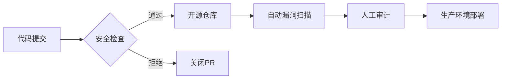

<!-- 组织名称与标志 -->

  <h1>上海锦麒行旅游信息咨询有限公司</h1>
  <h3>Jinqitrip Co. Ltd. | 让每一次出行成为美好体验</h3>
  

### 🌍 关于我们
**上海锦麒行**成立于2024年，总部位于上海，是一家专注于为商务旅客和高端休闲旅客提供一站式出行服务的技术驱动型企业。我们的服务涵盖酒店代订、机票预定、演唱会票务及车辆安排，通过会员积分系统、独家票务渠道和管家式服务优化用户体验。

**使命**：通过技术创新提升出行效率，打造个性化、高品质的旅行服务。  
**愿景**：成为中国领先的智慧出行解决方案提供商。

### 🛠 代码管理声明
- **混合开发模式**：本组织采用公开仓库与私有仓库并行的管理策略，核心业务系统因涉及客户隐私和商业机密保持私有状态，推动技术透明化的同时保障技术安全。
- **安全优先**：非公开仓库遵循严格的数据安全协议，确保技术安全。
- **开源选择**：我们选择开源的通常是工具类组件和通用解决方案，详见下方公开仓库列表。
- **持续优化**：采用敏捷开发模式，结合反馈持续迭代服务系统。

### 📂 公开仓库概览
> ℹ️ 以下为经董事会审核批准的开源项目：

*暂无*

### 🌟 特色服务
- **会员专属权益**：积分兑换、VIP通道、独家票务资源。
- **技术赋能体验**：AI行程规划、实时价格监控、智能客服系统。
- **合规保障**：所有服务均通过书面合同明确权责，保障资金与交易安全:cite[4]。

### 🤝 合作与贡献
**企业合作**  
欢迎与酒店集团、票务平台及技术服务商建立合作，请联系：`partner@jinqitrip.com.cn`

**开发者参与**  
部分开源项目接受贡献，请遵循：
1. Fork目标仓库并创建特性分支
2. 提交Pull Request并附详细说明
3. 通过代码审查后合并至主分支

### 🔒 开源仓库审查机制

### 📞 联系我们
- **官网**: [https://jinqitrip.com.cn](https://jinqitrip.com.cn)  
- **商务咨询**: `harry@jinqitrip.com`  
- **技术支持**: `fQwQf@jinqitrip.com`  
- **微信公众号**: 搜索“锦麒行旅行”

---

© 2024 上海锦麒行旅游信息咨询有限公司
