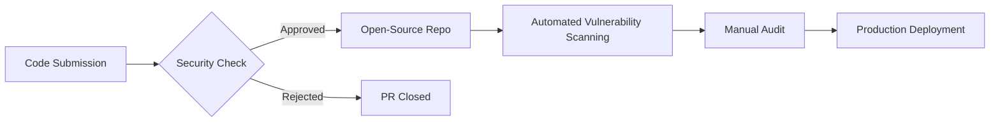

  <h1>Shanghai Jinqitrip Travel Information Consulting Co., Ltd.</h1>
  <h3>Jinqitrip Co. Ltd. | Turning Every Journey into an Exceptional Experience</h3>
  
   
  <a href="https://github.com/Jinqitrip/.github/blob/main/profile/README.md">中文</a> | English

### 🌍 About Us
**Jinqitrip**, established in 2024 and headquartered in Shanghai, is a technology-driven enterprise specializing in comprehensive travel solutions for business travelers and premium leisure guests. Our services encompass hotel bookings, flight reservations, concert ticketing, and vehicle arrangements, enhanced by membership reward systems, exclusive ticket channels, and concierge services.

**Mission**: To enhance travel efficiency through technological innovation and deliver personalized, high-quality travel services.  
**Vision**: To become China's leading intelligent travel solution provider.

### 🛠 Code Management Statement
- **Hybrid Development Model**: We maintain both public and private repositories, keeping core business systems private to protect client privacy and commercial confidentiality while promoting technical transparency.
- **Security First**: Private repositories adhere to strict data security protocols to ensure technical safety.
- **Open Source Strategy**: We selectively open-source toolkits and universal solutions as shown below.
- **Continuous Optimization**: Utilizing Agile development methodology to iteratively improve our systems through continuous feedback.

### 📂 Public Repositories Overview
> ℹ️ The following are open-source projects approved by our Board:

| Repository Name | Link | License | Description |
|---|---|---|---|
| JQX_campus_guide | https://github.com/Jinqitrip/JQX_campus_guide | GPL-3.0 | Outlines the grand blueprint of the Jinqitrip campus guide project |

### 🌟 Featured Services
- **Exclusive Member Benefits**: Reward point redemption, VIP channels, and exclusive ticket access.
- **Tech-Enhanced Experience**: AI-powered itinerary planning, real-time price monitoring, and intelligent customer service systems.
- **Compliance Assurance**: All services operate under legally binding contracts to ensure financial and transactional security[^4].

### 🤝 Collaboration & Contribution
**Enterprise Partnerships**  
We welcome collaborations with hotel groups, ticketing platforms, and technology providers. Contact: `harry@jinqitrip.com`

**Developer Participation**  
Selected open-source projects accept contributions following these steps:
1. Fork the target repository and create feature branches
2. Submit Pull Requests with detailed descriptions
3. Merge into main branch after code review

### 🔒 Open-Source Repository Review Mechanism

### 📞 Contact Us
- **Official Website**: [https://jinqitrip.com.cn](https://jinqitrip.com.cn)  
- **Business Inquiries**: `harry@jinqitrip.com`  
- **Technical Support**: `fQwQf@jinqitrip.com`  
- **WeChat Official Account**: Search "锦麒行旅行"

---

© 2024-2025 Shanghai Jinqitrip Travel Information Consulting Co., Ltd.
